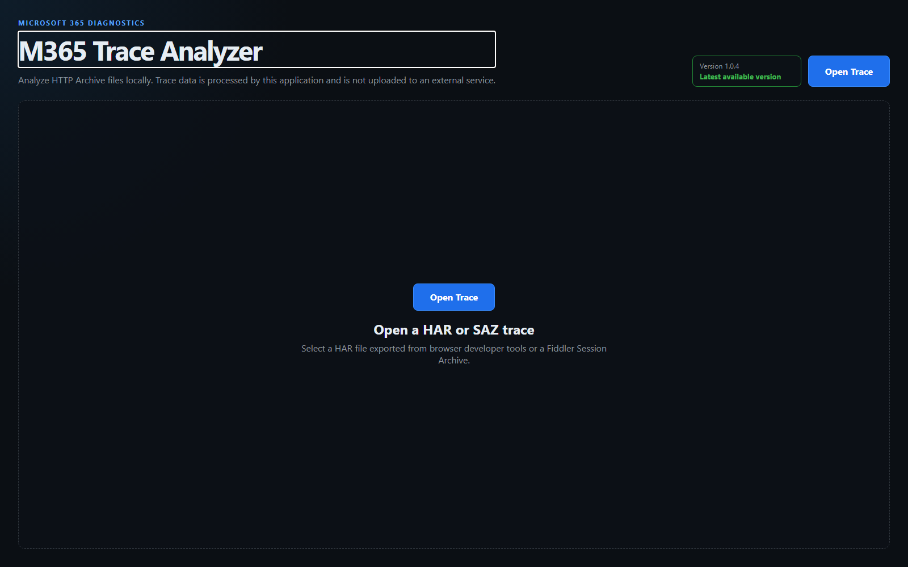

# M365 Trace Analyzer

M365 Trace Analyzer helps support engineers inspect and analyze Microsoft 365
HTTP traces through a local, browser-based interface.

It supports HAR and encrypted or unencrypted SAZ files, automatically identifies
common Microsoft 365 conditions, and provides searchable request, response, and
diagnostic details.

> [!IMPORTANT]
> Trace contents are processed locally and are not uploaded to an analysis
> service. The application web server is restricted to the local computer.



## Highlights

### Import and analyze

- Open HAR 1.x and Fiddler Session Archive (`.saz`) files.
- Open SAZ archives protected with ZipCrypto, AES-128, or AES-256.
- Run Microsoft 365 diagnostic classifications automatically.
- Identify partial, truncated, malformed, or unsupported trace content.
- Retain usable sessions when a trace is only partially valid.

### Investigate traffic

- Search URLs, methods, status codes, headers, bodies, and findings.
- Filter by severity, status, duration, authentication, and other properties.
- Drill from trace-wide summaries into matching sessions.
- Review elevated Microsoft 365 diagnostic headers.
- Inspect request and response content as raw text, JSON, XML, sandboxed HTML,
  or images.

### Work with large traces

- Use a virtualized session grid with keyboard navigation.
- Cancel long-running imports and analysis.
- Prevent an older operation from replacing a newer file selection.
- Apply bounded parsing and archive-expansion limits to untrusted input.

## Quick start

1. Download the [latest Windows release](../../releases/latest).
2. Extract `M365-Trace-Analyzer-vX.Y.Z-win-x64.zip`.
3. Open a terminal in the extracted directory.
4. Run:

```powershell
./M365Trace.Web.exe
```

The analyzer opens at `http://localhost:8080`. Keep the terminal open while
using the application and press `Ctrl+C` to stop it.

To select another local port:

```powershell
./M365Trace.Web.exe --port 9090
```

The application always listens only on the local computer's IPv4 and IPv6
loopback interfaces. Network-interface and wildcard bindings are not supported.

## Supported trace files

| Format | Support |
| --- | --- |
| HAR 1.x | Browser-exported HTTP Archive JSON with protocol, endpoint, connection, redirect, cache, query, cookie, page, timing, size, and content-completeness metadata when available |
| SAZ | Encrypted or unencrypted Fiddler Session Archives containing request, response, and optional metadata files |

SAZ imports decode chunked and compressed bodies in wire order and distinguish
unsupported encodings from corrupt content. Passwords are used only for the
current import and are not stored.

Some diagnostic rules depend on metadata that HAR files do not normally
contain, such as process names, client or server IP addresses, TLS tunnel
details, or detailed server timing. The analyzer does not guess missing values.

## Security and privacy

- Trace parsing, analysis, filtering, and display occur on the local computer.
- Imported sessions and findings remain in process memory until another trace
  replaces them or the application exits.
- SAZ files use a temporary local copy during archive inspection and delete it
  after the import attempt.
- The application makes one anonymous request to the public GitHub Releases API
  to check for a newer published version. Analysis continues when offline.
- Anonymous product-usage telemetry is available only in configured builds,
  requires explicit consent, and excludes trace-derived content.

See [Security and privacy](docs/SECURITY-AND-PRIVACY.md) for the complete data
flow and storage description. Report suspected vulnerabilities privately
according to [SECURITY.md](SECURITY.md).

## Documentation

- [Security and privacy](docs/SECURITY-AND-PRIVACY.md)
- [Security assurance](docs/SECURITY-ASSURANCE.md)
- [Data handling](docs/DATA-HANDLING.md)
- [Public threat model](docs/THREAT-MODEL.md)
- [Security testing](docs/SECURITY-TESTING.md)
- [Support-engineer operating guide](docs/SUPPORT-ENGINEER-OPERATING-GUIDE.md)
- [Anonymous usage telemetry](docs/USAGE-TELEMETRY.md)
- [Classification coverage](CLASSIFICATION-COVERAGE.md)
- [Architecture](docs/ARCHITECTURE.md)
- [Performance benchmarks](docs/PERFORMANCE-BENCHMARKS.md)
- [Support-engineering roadmap](docs/SUPPORT-ENGINEERING-ROADMAP.md)
- [Contributing](CONTRIBUTING.md)
- [Release process](docs/RELEASING.md)
- [Apache License 2.0](LICENSE)

## Build and test

The repository requires the .NET SDK version declared in `global.json`.

```powershell
dotnet restore .\M365-Trace-Analyzer.sln
dotnet build .\M365-Trace-Analyzer.sln --configuration Release --no-restore
dotnet test .\M365-Trace-Analyzer.sln --configuration Release --no-build
```

See [CONTRIBUTING.md](CONTRIBUTING.md) for secure development requirements,
validation expectations, and rules for synthetic or sanitized fixtures.
