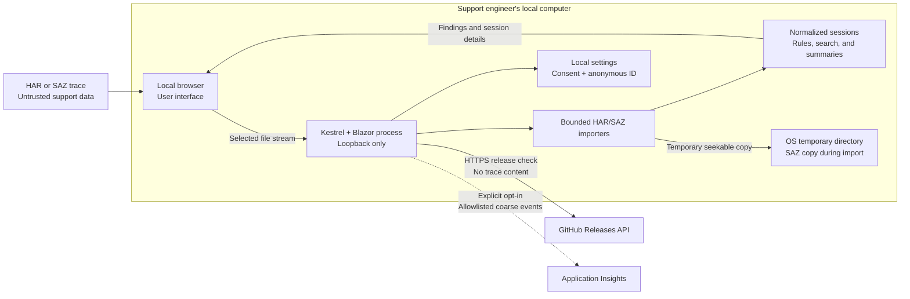

# Public threat model

## Document control

| Field | Value |
| --- | --- |
| Owner | Repository maintainers, with review by the appropriate security teams |
| Version | 1.1 |
| Last reviewed | 2026-09-29 |
| Next review | At least annually or when a review trigger occurs |
| Method | STRIDE-inspired data-flow and trust-boundary review |
| Status | Repository baseline reviewed; independent assessment pending |

This public model intentionally excludes confidential infrastructure details,
assessment records, internal contacts, and unresolved exploit information.

The editable diagram source is
[M365 Trace Analyzer data flow](diagrams/m365-trace-analyzer-data-flow.excalidraw).

## Scope

This model covers:

- The standalone Windows x64 application.
- HAR and SAZ importers.
- Browser interface and local Kestrel server.
- Diagnostic rules, search, summaries, and content previews.
- Optional usage telemetry.
- Release update checking.
- Build and release workflows.
- The published ZIP, checksum, SBOM, and attestations.

## Assumptions

- The application runs as a single user on a managed Windows computer.
- The operating system, browser, temporary directory, and user account are
  trusted to enforce their normal security boundaries.
- The user is authorized to access each selected trace.
- The application is obtained from the official release location.
- The application runs without administrative privileges.
- The analyzer is not exposed through a proxy, tunnel, container port, or
  network-interface binding.

## Out of scope

- Compromise of the operating system, browser, or user account.
- Authorization decisions for access to source traces.
- Security of the system that originally generated a trace.
- Shared, hosted, remote, multi-user, or Windows-service deployments.
- Third-party redistribution or modified builds.
- Operational security of a telemetry resource beyond the controls recorded in
  the confidential audit package.

## Security objectives

- Keep diagnostic trace contents on the local computer.
- Prevent network clients on other computers from reaching the application.
- Prevent trace-derived content from executing active code or loading remote
  resources in previews.
- Bound resource use when parsing large, malformed, or hostile files.
- Avoid collecting trace-derived values in usage telemetry.
- Avoid persisting archive passwords.
- Produce attributable release artifacts with integrity, provenance, and
  component evidence.
- Provide a private vulnerability-reporting and remediation process.

## Data-flow diagram

## Assets

- HAR and SAZ source files.
- URLs, headers, bodies, cookies, tokens, and authentication material contained
  in traces.
- Analysis findings and normalized session data.
- Passwords supplied for encrypted SAZ archives.
- Telemetry consent and anonymous identifiers.
- Source code, dependencies, workflows, release artifacts, SBOMs, checksums,
  and attestations.

## Trust boundaries

1. **TB-01 — Trace to browser:** The selected file is untrusted input.
2. **TB-02 — Browser to local process:** File content crosses the local
   loopback connection into the parser.
3. **TB-03 — Importer to temporary storage:** SAZ content is copied to the
   operating system's temporary directory.
4. **TB-04 — Trace content to preview:** Attacker-controlled bodies are rendered
   as text, images, sandboxed HTML, or formatted XML.
5. **TB-05 — Application to GitHub:** The update checker makes an outbound HTTPS
   request.
6. **TB-06 — Application to telemetry:** Allowlisted events are sent only after
   explicit opt-in when telemetry is configured.
7. **TB-07 — Repository to release:** Dependencies and workflows produce the
   published package and evidence artifacts.

## Threat register

| ID | STRIDE category | Threat | Risk | Mitigation | Evidence | Status |
| --- | --- | --- | --- | --- | --- | --- |
| TM-001 | Denial of service | Malformed or oversized HAR exhausts memory or CPU | Medium | File-size, entry-count, retained-text, metadata, JSON-depth, and cancellation limits | HAR importer tests | Mitigated |
| TM-002 | Denial of service | Archive bomb or oversized SAZ exhausts disk, memory, or CPU | High | Compressed-size, expanded-size, entry-count, entry-size, retained-text, and cancellation limits | SAZ importer tests | Mitigated |
| TM-003 | Tampering / elevation | Archive path traversal writes outside intended storage | High | Validate archive paths; read entries without extraction to caller-controlled paths | `ImportAsync_UnsafeEntryPath_IsRejected` | Mitigated |
| TM-004 | Elevation / information disclosure | Malicious HTML executes script or loads remote content | High | Sandboxed iframe, restrictive CSP, no-referrer policy, scripts and remote resources blocked | `BodyInspector.razor`, component tests | Mitigated |
| TM-005 | Information disclosure | XML external entities read local or remote resources | High | Prohibit DTD processing and disable external resolution | XML implementation and component tests | Mitigated |
| TM-006 | Information disclosure | Trace data enters telemetry | High | Explicit consent, fixed allowlist, coarse buckets, schema tests, no automatic framework collection | Telemetry tests and documentation | Mitigated |
| TM-007 | Information disclosure | Archive password is persisted, logged, or reported | High | Scope password to active import; clear component state; exclude from settings and telemetry | Password and telemetry tests | Mitigated |
| TM-008 | Information disclosure | Temporary SAZ copy remains after abnormal termination | Medium | Unique name and `finally` deletion; operating guide requires residual cleanup after abnormal termination | Importer implementation and operating guide | Residual risk |
| TM-009 | Spoofing / information disclosure | Application becomes reachable from another device | High | `ListenLocalhost`, reject `--urls`, URL configuration cannot broaden listener, Host filtering | Packaged listener tests | Mitigated |
| TM-010 | Spoofing | Malicious Host header or browser-origin behavior targets the loopback service | Medium | Restrict allowed Host values, antiforgery middleware, no supported remote mode | Packaged Host validation | Mitigated |
| TM-011 | Denial of service | Update service failure blocks trace analysis | Low | Timeout, one process-cached request, offline failure does not disable analysis | Version service tests and behavior | Mitigated |
| TM-012 | Tampering | Vulnerable or malicious dependency enters the build | High | Dependency review, Dependabot, vulnerable-package scan, CodeQL, pinned manifests, SBOM | CI/Security workflows and release SBOM | Mitigated |
| TM-013 | Tampering / repudiation | Published package is replaced or cannot be attributed | High | SHA-256, build provenance, SBOM attestation, retained release history | Release workflow and attestation records | Mitigated |
| TM-014 | Information disclosure | Sensitive data is exposed through public collaboration | High | Repository policy, issue templates, contribution rules, synthetic fixtures only | `SECURITY.md`, `CONTRIBUTING.md`, issue templates | Mitigated |
| TM-015 | Spoofing / repudiation | Telemetry events are forged | Low | Treat telemetry as non-authoritative product usage only; monitor unexpected volume | Telemetry documentation and workbook annotation | Accepted |
| TM-016 | Tampering | A modified executable is presented as an official release | Medium | Official release location, checksums, attestations, SBOM; Authenticode signing remains planned | Release evidence and assurance matrix | Partially mitigated |

## Residual risks and decisions

| Risk | Decision |
| --- | --- |
| Hard termination can leave a temporary SAZ copy | Documented user cleanup requirement; accepted pending an operating-system cleanup enhancement |
| Files within allowed limits can still consume substantial resources | Accepted with cancellation, benchmark budgets, and documented limits |
| The application cannot determine whether a user is authorized to analyze a trace | Authorization remains an organizational and user responsibility |
| Findings inherit sensitive values from the source trace | Users must review output before sharing |
| Desktop telemetry events can be spoofed | Telemetry is explicitly non-authoritative and not an audit log |
| Dependencies cannot be proven vulnerability-free | Continuous monitoring, SBOM, release replacement, and vulnerability response reduce but do not eliminate risk |
| Published executable is not Authenticode signed | Tracked as planned control `REL-04`; checksum and attestations provide current integrity evidence |

## Review triggers

Review this model when a change:

- Adds a trace format, parser, body renderer, or active-content preview.
- Adds authentication, authorization, remote access, or multi-user behavior.
- Persists trace data or findings outside process memory.
- Adds or changes a network destination.
- Changes telemetry fields, consent behavior, resource configuration, or
  settings storage.
- Changes file limits, archive handling, encryption handling, or temporary-file
  behavior.
- Adds a hosted service, AI integration, browser extension, or cloud storage.
- Changes release signing, checksums, SBOMs, attestations, or update behavior.
- Introduces a security incident or independent-assessment finding that changes
  the risk register.

Material changes require review by the appropriate security teams before
release.
